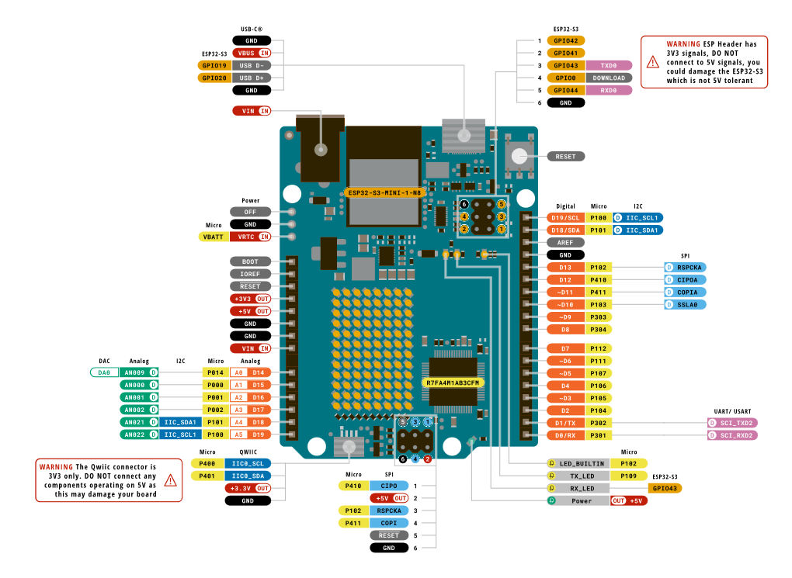
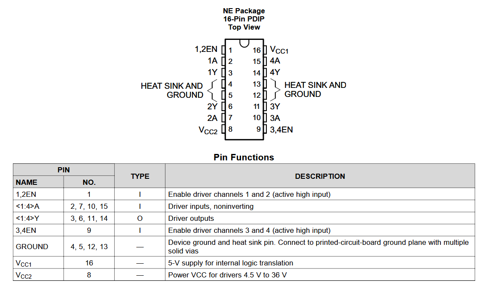
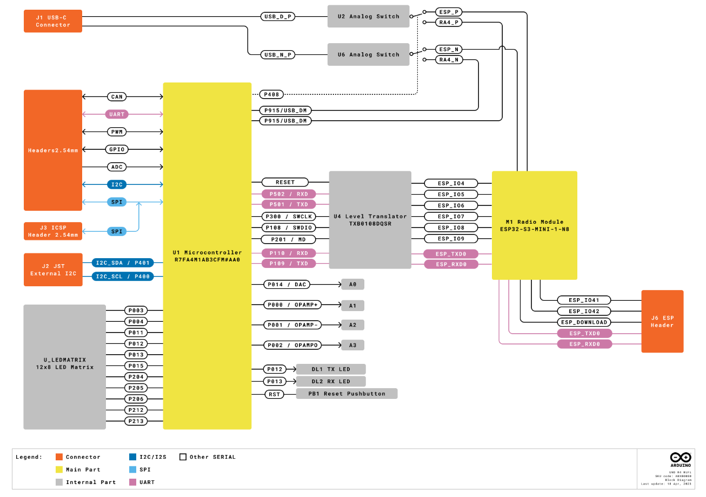

<details>
  <summary>Table of Contents</summary>
  <ol>
    <li><a href="#about">About</a></li>
    <li><a href="#roadmap">Roadmap</a></li>
    <li><a href="#build">Build</a></li>
    <li><a href="#libraries">Libraries</a></li>
    <li><a href="#theory">Theory</a>
      <ul>
        <li><a href="#introduction">Introduction</a></li>
        <li><a href="#hardware">Hardware</a></li>
        <li><a href="#control-system">Control System</a></li>
          <ul>
            <li><a href="#motor-control">Motor Control</a></li>
            <li><a href="#pid-control">PID Control</a></li>
          </ul>
        <li><a href="#wifi">WiFi</a></li>
          <ul> 
            <li><a href="#challenges">Challenges</a></li>
            <li><a href="#solution">Solution</a></li>
          </ul>
      </ul>
    </li>
  </ol>
</details>

# About


Here I'll be explaining all the code that went into the Arduino buggy as well as all the various Libraries, theory and hardware manipulation that had to be done to optimise the computation and execution speed of the buggy.

# Build

### VS Code
To build the project you should download and install VS Code, and install the PlatformIO extension, this extension provides functionality for building and uploading code to various Embedded Systems like the Arduino Uno R4 WiFi and ESP32-S3-MINI-1 in our case

### Upload Commands

To actually upload the two files to their respectiev chip you want to the following commands inside the PIO Terminal.

```sh
pio run -e esp32 -t upload
```

```sh
pio run -e unoR4 -t upload -t monitor
```

# Libraries

This Project uses various prebuilt and external Libraries for various functions within the arduino, some are used in both the Renesas RA4M1 chip and the ESP32-S3-MINI-1.

### Common Libraries

*   functional 
*   unordered_map
*   PacketSerial.h

### Renesas RA4M1 Libraries

*   NewPing.h
*   PID.h

### ESP32 Libraries

*   WiFi.h
*   WebSocketsServer.h
*   ArduinoJson.h
*   esp_uno_r4.h


# Theory

## Introduction



Here I will begin the theory part of understanding how the Buggy works, and why it works. Firstly in the image above you will see the detailed arduino Pinout, this shows and describes all the various pins on the board and what we will use them for.

## Hardware

### Arduino Uno R4 WiFi

So what hardware do we have on our buggy. Well ofcouse the Arduino Uno R4 WiFi board, this is a microcontroller board that will perform all the calculations for us, it will take inputs through its digital or analog pins and then send outputs throught similar pins either Digitally or through PWM.

### IR Sensors

Next, we have our IR Sensors, this is a generic piece of hardware that isnt specific to any model or version as they all work basically the same. There are power pins and then an option of two outputs, either Digital Output (DO) or Analog Output (AO), for this project we will only focus on the Digital one because in our case we will only worry about the difference between black or white, so we can have a binary representation of that.

### HC-SR04 US Rangefinder

At the front of the Buggy is also a HC-SR04 Ultrasonic Sensor, this device has four pins, two power pins, and two data pins, a TRIG and an ECHO pin. The Trigger pin is the inital signal that we send to start ranging, the device then send out 8 short cyclic sonic bursts, we dont hear it since its in the 40kHz range, we then listen to the return signal, when the burts return to the device it will trigger the ECHO pins, we can then calculate the range to target by simply timing the difference between the inital trigger and the received echo.

### Motors

Attached to the Buggy are two small DC Motors, these have two lines each coming out of them these are power lines which will dictate the direction of the motor. These motors need 3-6V to operate normally, and roughly 180-250 mA current draw, Arduino pins dont supply enough current to move the motors which is why we use 6 AA batteries, which can supply enough voltage and current to the motors.

### L293DNE H-Bridge

To control the motors we will use a H-Bridge to allow us to supply enough voltage to the motor driver pins while also allowing us to control the speed of each motor through Pulse Width Modulation (PWM), the H-Bridge also has built-in flyback protection. Flyback is when you remove a DC Source from an inductor cauysing the magnetic field around it to collapse and cause a voltage spike across it, this in turn would cause high voltage spikes and current to go into the arduino, but by using flyback diodes which are inside the H-Bridge this can be prevented.

### Hall Effect Wheel Encoders

These Hall Effect Arrays are placed near the motor and are reacting to a small metal disk attached to the driving axel. As the wheel rotates, the Hall Sensor will trigger sending a pulse down the signal line, we can determine the speed of the buggy by timing how long these pulses take, a full rotation was roughly 5-6 pulses, meaning we can just take the cirumference of the wheel and see how long it took to travel that amount, and then upscale it to a known unit, like cm/s.

### HuskyLens AI Camera

TBD

## Control System

### Motor Control

As before we will use the H-Bridge to control the motors over PWM.



The pins will be used as follows:

* 1 & 9 - Enable Driver Channels, PWM Driver Pins
* 2 & 7 - Arduino output pins to determine the direction of motor 1
* 10 & 15 - Arduino output pins to determine the direction of motor 2
* 3 & 6 - Driver output pins, pins of motor 1
* 11 & 14 - Driver output pins, pins of motor 2
* 16 - Internal Power, 5V input from Arduino
* 8 - Power for the motors, 7.2V from Batteries
* 4, 5, 12 & 13 Ground Pins

By setting the driver output pins to a combination of high or low we can get the motors to move forward or backwards, and by using PWM for the enable pins we can change the speed of the motors.

### PID Control

TBD

## WiFi
### Challenges

A big challenge in controlling the buggy is the WiFi Communication and Interface, since Performance is a big concern for this buggy, and we want as quick of a loop time as possible we have to optimise WiFi communication.

The problem is that we don't to constantly poll the client, or the server for updates if they don't exist.

For example, as a server, I dont need to constantly send updates to the client every loop execution if the values didnt change, if im constantly sending the same data then thats a waste of computational time. 

Same goes for the Client, I dont want to constantly ask the server for updates, the server should always send me updates if they are available, and i shouldnt send it data from the user unless that changed.

### Solution

To accomplish this we need asynchronicity, we want both the client and server to only send and receive updates if they change from the last sent state.

We also need to centralise our code, this is why I dont want to use Processing, because it relies on the fact that someone else has code to receive data from the buggy, deserialise it, and then use it, it would be better if the arduino 
could  serve the client the code that it can then use.

That is exactly what a Web Server does, a Client connects to a network from which it can send a request to the server, then the server sends a response to the client.

We will use the HTTP protocol to achieve this and we will supplement it with WebSockets Protocol. HTTP deals with the initial handshake between the client and server, while WebSockets handles the asynchronous data exchange between the two clients, the data sent using websockets is commonly a JSON formatted file, which is exactly what we use.

JSON file format is a simple format for transmitting human-readable data consisting of Name-Value pairs

```json
// Example JSON Format
"Enable": 1,
"Speed": 120,
"Distance": 23
```

### HTTP

So first the client will send a request, this is by the standard either on port 80 for HTTP and port 443 for HTTPS, this request is standard and will always have the same format, it will consist of a GET, which is a HTTP Method, basically saying retrieve data without changing the server. then it'll specify the resource path, and then itll have HTTP version which we dont really need to look at in the request, we only care for the first two things.

```http
GET / HTTP/1.1
```
The request above asks for data in the root directory, which can either be html or php, php being a dynamic script, we only care about html.

We now have to fulfill the request and send the server the response. The response will need a few headers before the main data, we have to tell the client that we have successfully received the request, we then have to specify what type of data we will send, and finally a break to tell the client that the next data sent will be the data it wants.

```http
HTTP/1.1 200 OK
Content-Type: text/html
<!-- break -->
<!-- send main data -->
```

The response above tells the client through HTTP codes, that it successfully received and will process the request (200 OK), then itll speecify the type of data, text/html.

For CSS and JavaScript its similar, however the resource directory in the requset will change to /style.css and /script.js respectively, and the response type will be text/css and application/javascript.

### WebSocket

TBD


